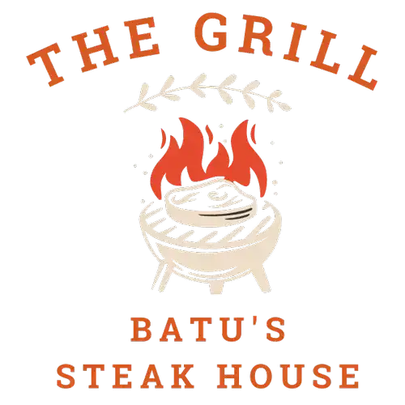

<div id="top"></div>

<!-- PROJECT LOGO -->
<br />
<div align="center">
  <a href="https://github.com/batunpc/Steakhouse">
    
  </a>

<h3 align="center">Meal delivery website - WEB322 Assignment 5</h3>

  <p align="center">
    REST API to manage meals and authorization <br> with Node.js and Express.
    <br />
    <a href="https://github.com/batunpc/Steakhouse"><strong>Explore the docs »</strong>
    </a>
    <br />
    <br />
    <a href="https://stark-crag-53181.herokuapp.com/">View Demo</a>
    ·
    <a href="https://github.com/batunpc/Steakhouse/issues">Report Bug</a>
    ·
    <a href="https://github.com/batunpc/Steakhouse/issues">Request Feature</a>
  </p>
</div>

<!-- TABLE OF CONTENTS -->
<details>
  <summary>Table of Contents</summary>
  <ol>
    <li>
      <a href="#about-the-project">About The Project</a>
      <ul>
        <li><a href="#built-with">Built With</a></li>
      </ul>
    </li>
    <li>
      <a href="#getting-started">Getting Started</a>
      <ul>
        <li><a href="#prerequisites">Prerequisites</a></li>
        <li><a href="#installation">Installation</a></li>
      </ul>
    </li>
    <li><a href="#acknowledgments">Acknowledgments</a></li>
  </ol>
</details>


<!-- ABOUT THE PROJECT -->
## About The Project
There are many great RESTful APIs available on GitHub; however I created this website based on my college requirements, so there might be things that you may notice I took the roadmap in a longer way. Although it was nice experience creating my first RESTful API using expressJS, sequelize, express-handlebars as templating engine and postgreSQL as database. <br>
The instructions for section WEB322 Assignment 4 & 5 can be found in pdf file.

<p align="right">(<a href="#top">back to top</a>)</p>


### Built With
* [Node.js](https://nodejs.org/en/)
* [Express.js](https://expressjs.com/)
* [PostgreSQL](https://www.postgresql.org/)
* [Sequelize](https://sequelize.org/)
* [Bootstrap](https://getbootstrap.com)

### Following Node libraries used:
* express
* express-handlebars
* express-validator
* multer
* nodemon
* pg
* pg-hstore
* sequelize


<p align="right">(<a href="#top">back to top</a>)</p>


<!-- GETTING STARTED -->
## Getting Started

To get a local copy up of the app and running follow these simple example steps.

### Prerequisites

This is an example of how to list things you need to use the software and how to install them.
* npm
  ```sh
  npm install
  ```

### Installation

1. Clone the repo
   ```sh
   git clone https://github.com/batunpc/Steakhouse.git
   ```
3. Install NPM packages
   ```sh
   npm install
   ```
4. Start server locally
   ```sh
   npm run 'devstart';
   ```

<p align="right">(<a href="#top">back to top</a>)</p>


<!-- ACKNOWLEDGMENTS -->
## Acknowledgments

* [GitHub Pages](https://pages.github.com)
* [Font Awesome](https://fontawesome.com)
* [NodeJS Documents](https://fontawesome.com)
* [ExpressJS Documents](https://expressjs.com/en/guide/using-middleware.html)
* [Sequelize](https://sequelize.org/master/manual/validations-and-constraints.html)
* [cdJS](https://cdnjs.com/libraries/skeleton)

<p align="right">(<a href="#top">back to top</a>)</p>
